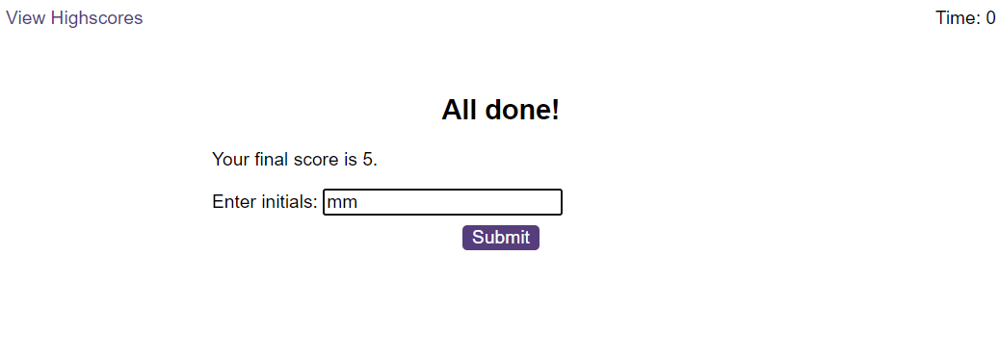
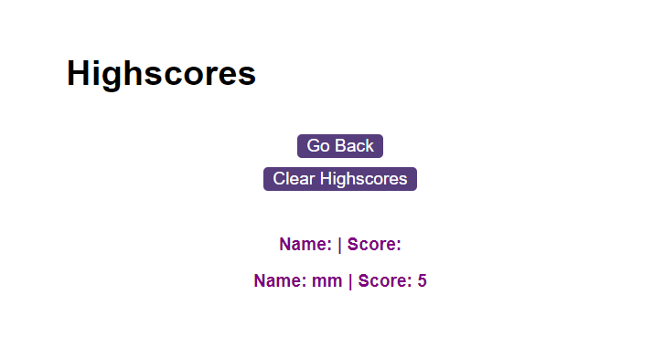

# Module 6 Challenge Web APIs: Code Quiz

## Description

This week's challenge revolves around creating a coding quiz, and the questions have to contain anything with regards to JavaScript foundations.

The challenge was elevated, and designed to push our coding abilities and utilise all that we have learned, plus use our Googling/research skills to complete it.

## Screenshots

The following screenshots show completed challenge.

## Links

Published site link:
https://mrmaciejm.github.io/javascript-foundations-quiz/

Repository link:
https://github.com/MrMaciejM/javascript-foundations-quiz
